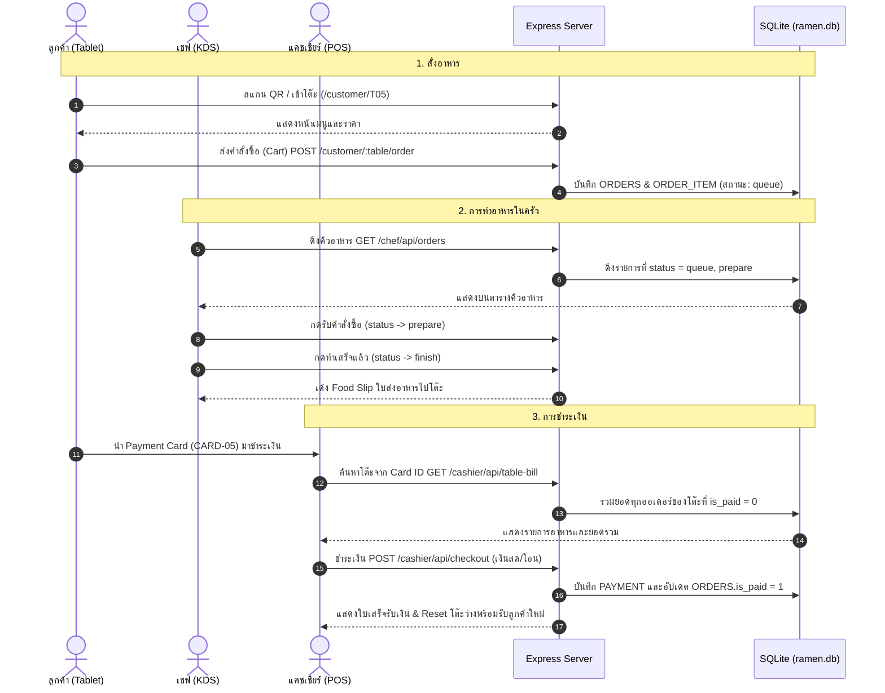

# 🍜 IsadRamen (Koumiya Ramen) - System & File Documentation

เอกสารฉบับนี้จัดทำขึ้นเพื่ออธิบายโครงสร้างระบบ รายละเอียดของทุกไฟล์และโฟลเดอร์ในโปรเจกต์ ว่าแต่ละส่วนทำหน้าที่อะไรและทำงานร่วมกันอย่างไร

---

## 🏗️ 1. สถาปัตยกรรมและเทคโนโลยีที่ใช้ (Tech Stack)

* **Runtime Environment:** Node.js (CommonJS)
* **Web Framework:** Express.js 5
* **Database:** SQLite3 (`database/ramen.db`) พร้อมระบบ Auto-Init Schema และ Seed Data
* **Template Engine:** EJS (Embedded JavaScript)
* **Styling & UI:** Tailwind CSS (ออกแบบให้เป็นมิตรกับหน้าจอสัมผัส Tablet แนวนอน / Click & Touch Friendly)
* **Standard & Rules:** ปฏิบัติตามแนวทางใน [AGENTS.md](AGENTS.md) โดยไม่มีการใช้ `innerHTML` ในโค้ด และใช้ Standard DOM Methods ทั้งหมด

---

## 📂 2. โครงสร้างโฟลเดอร์และหน้าที่ของแต่ละไฟล์ (Directory & File Map)

```text
IsadRamen/
├── database/                   # จัดการฐานข้อมูล SQLite (Schema, Seed, DB File)
│   ├── ramen.db                # ไฟล์ฐานข้อมูล SQLite จริงที่ระบบใช้งาน
│   ├── schema.sql              # คำสั่ง SQL สร้างตารางข้อมูลทั้งหมด 11 ตาราง
│   ├── seed.sql                # คำสั่ง SQL โหลดข้อมูลเริ่มต้น (โต๊ะ 1-20, เมนู, ตัวเลือก, ท็อปปิ้ง)
│   └── menu.json               # ข้อมูล JSON อ้างอิงรายการเมนูอาหาร
├── public/                     # ไฟล์ Static Assets ที่เข้าถึงได้โดยตรงผ่านเว็บ
│   ├── css/
│   │   └── style.css           # สไตล์ชีต CSS ที่คอมไพล์จาก Tailwind CSS
│   └── images/                 # รูปภาพเมนูอาหาร โลโก้ร้าน และ Mock QR Code
├── routes/                     # ตัวจัดการเส้นทาง (Express Router) และ Business Logic
│   ├── customer.js             # Route หน้าลูกค้า สั่งอาหาร ตะกร้าสินค้า และประวัติ
│   ├── chef.js                 # Route หน้าห้องครัว (Chef KDS) รับออเดอร์ ทำเสร็จ และ Food Slip
│   ├── cashier.js              # Route หน้าแคชเชียร์ POS ผังโต๊ะ คำนวณเงิน ชำระเงิน และซิงค์จอลูกค้า
│   └── scan.js                 # Route จำลองการสแกน QR Code เพื่อแจกโต๊ะอัตโนมัติ T01-T20
├── src/                        # ซอร์สโค้ดสำหรับคอมไพล์ Frontend
│   └── input.css               # ไฟล์ตั้งค่า Tailwind CSS ต้นฉบับ
├── views/                      # หน้าจอแสดงผล HTML (EJS Templates)
│   ├── customer/               # หน้าจอฝั่งลูกค้า (Tablet ประจำโต๊ะ)
│   │   ├── start.ejs           # หน้าจอเริ่มต้น "ยินดีต้อนรับ / แตะหน้าจอเพื่อเริ่มสั่งอาหาร"
│   │   ├── menu.ejs            # หน้าจอหลัก เลือกเมนู, Customize Modal, ตะกร้าสินค้า และจอรออาหาร
│   │   └── history.ejs         # หน้าจอประวัติอาหารที่สั่งในรอบปัจจุบัน พร้อมปุ่มแจ้งชำระเงิน
│   ├── chef/                   # หน้าจอฝั่งห้องครัว (Chef KDS)
│   │   └── index.ejs           # หน้าจอคิวอาหาร (Queue), ประวัติ (History), Popup ปรุงอาหาร และ Food Slip
│   ├── cashier/                # หน้าจอฝั่งแคชเชียร์และชำระเงิน
│   │   ├── index.ejs           # หน้าจอ POS หลัก (ผังโต๊ะ 20 โต๊ะ, ตารางบิล, Keypad ตัวเลข, Modal ใบเสร็จ)
│   │   ├── customer-display.ejs# หน้าจอฝั่งลูกค้า (แสดงเลขโต๊ะ ยอดเงิน และ QR Code ชำระเงิน)
│   │   └── receipt.ejs         # หน้าจอแสดงใบเสร็จรับเงินแบบเดี่ยว
│   └── home.ejs                # หน้าศูนย์ควบคุมหลัก (Main Control Hub) และ Acceptance Checklist
├── detail/                     # เอกสารสเปกและรายละเอียดความต้องการระบบ
│   ├── detail.md               # สเปกระบบ Database และ Use Cases
│   ├── ramen_demo_prompt.md    # รายละเอียดโจทย์และ Acceptance Criteria 29 ขั้นตอน
│   ├── README.md               # เอกสารภาพรวมฉบับย่อ
│   └── conclude.md             # บันทึกสรุปผลการปรับปรุงและการทดสอบระบบ
├── database.js                 # โมดูลเชื่อมต่อ SQLite และรัน Schema/Seed อัตโนมัติเมื่อเริ่มต้น
├── index.js                    # จุดเริ่มต้นของ Server (Entry Point) รวม Route และตั้งค่า Middleware
├── tailwind.config.js          # ไฟล์ตั้งค่า Tailwind CSS (ฟอนต์ Prompt และสี)
├── package.json                # ข้อมูลโปรเจกต์ Scripts และ Dependencies
├── AGENTS.md                   # กฎและข้อบังคับในการพัฒนา (ห้ามใช้ innerHTML)
└── README.md                   # เอกสารคู่มือและคำอธิบายระบบ (ไฟล์นี้)
```

---

## 🔍 3. คำอธิบายการทำงานเชิงลึกของแต่ละไฟล์

### 🚀 3.1 ไฟล์หลักของระบบ (Root Files)

* **[index.js](index.js)**:
  * เป็นไฟล์หลักสำหรับเริ่มการทำงานของ Express Server (พอร์ตเริ่มต้น: `3000`)
  * ตั้งค่า View Engine เป็น `ejs` และชี้โฟลเดอร์ static ไปที่ `public/`
  * แมป Route หลัก:
    * `/customer` ➡️ `routes/customer.js`
    * `/chef` และ `/kitchen` ➡️ `routes/chef.js` (รองรับ alias `/kitchen` เพื่อเข้าหน้าครัวได้ทันที)
    * `/cashier` ➡️ `routes/cashier.js`
    * `/scan` ➡️ `routes/scan.js`
    * `/mainControl` ➡️ `views/home.ejs`
    * `/` ➡️ เรียกใช้ฟังก์ชัน `scanRouter.assignTableAndRedirect` เพื่อแจกโต๊ะอัตโนมัติ
  * มี API `/api/reset-demo-orders` สำหรับล้างข้อมูลคำสั่งซื้อและการชำระเงินเพื่อเริ่มต้นทดสอบ Demo ใหม่

* **[database.js](database.js)**:
  * ทำหน้าที่เชื่อมต่อกับ SQLite (`database/ramen.db`)
  * มีฟังก์ชัน `initDatabase()` ที่จะตรวจสอบว่าตาราง `TABLES` มีอยู่หรือไม่ หากยังไม่มี จะอ่านไฟล์ [database/schema.sql](database/schema.sql) และ [database/seed.sql](database/seed.sql) มารันสร้างตารางและใส่ข้อมูลตั้งต้นโดยอัตโนมัติ
  * สร้างตาราง `SYSTEM_STATE` เพื่อจดจำสถานะของระบบ เช่น หมายเลขโต๊ะที่แจกล่าสุด

* **[tailwind.config.js](tailwind.config.js)**:
  * ตั้งค่าฟอนต์มาตรฐานของระบบให้ใช้ฟอนต์ `Prompt` แบบ sans-serif

* **[AGENTS.md](AGENTS.md)**:
  * เอกสารข้อตกลงและกฎความปลอดภัยของโปรเจกต์ กำหนดให้ใช้เฉพาะ Standard DOM Methods (`document.createElement`, `element.textContent`, `element.append`, `element.replaceChildren`) และ **ห้ามใช้ `innerHTML`, `outerHTML`, หรือ `insertAdjacentHTML` โดยเด็ดขาด**

---

### 🗄️ 3.2 โฟลเดอร์ฐานข้อมูล (`database/`)

* **[database/ramen.db](database/ramen.db)**:
  * ไฟล์ฐานข้อมูล SQLite ตัวจริง เก็บข้อมูลทั้งหมดของระบบ
* **[database/schema.sql](database/schema.sql)**:
  * โครงสร้าง DDL ประกอบด้วย 11 ตาราง:
    1. `TABLES`: ข้อมูลโต๊ะ (1-20) และ Card ID (`CARD-01` ถึง `CARD-20`)
    2. `MENU_CATEGORY`: หมวดหมู่เมนู (ราเมง, ของทานเล่น, เครื่องดื่ม)
    3. `MENU_ITEM`: รายการอาหาร 54 เมนู พร้อมราคาและรูปภาพ
    4. `OPTION`: ตัวเลือกการปรุงฟรี (ระดับความนุ่มเส้น, ความเข้มข้นซุป, ระดับความเผ็ด, ปริมาณต้นหอม)
    5. `TOPPING`: ท็อปปิ้งเสริมที่คิดเงินเพิ่ม (หมูชาชู, ไข่ต้มซีอิ๊ว, หน่อไม้, สาหร่าย ฯลฯ)
    6. `ORDERS`: ออเดอร์หลักที่ผูกกับโต๊ะ และสถานะการชำระเงิน (`is_paid`)
    7. `ORDER_ITEM`: รายการอาหารในแต่ละออเดอร์ พร้อมสถานะ (`queue`, `prepare`, `finish`)
    8. `ORDER_ITEM_OPTION`: ตัวเลือกการปรุงที่ลูกค้าเลือกสำหรับเมนูนั้นๆ
    9. `ORDER_ITEM_TOPPING`: ท็อปปิ้งที่ลูกค้าสั่งเพิ่มพร้อมจำนวนและราคา
    10. `PAYMENT`: บันทึกประวัติการชำระเงิน ยอดรวม เงินที่จ่าย เงินทอน และวิธีชำระ
    11. `SYSTEM_STATE`: ตารางเก็บค่าระบบ Key-Value (เช่น ลำดับโต๊ะที่แจกล่าสุด)
* **[database/seed.sql](database/seed.sql)**:
  * ข้อมูลเริ่มต้น: โต๊ะ 20 โต๊ะ, หมวดหมู่อาหาร, เมนูราเมงและของทานเล่น 54 รายการ, ท็อปปิ้ง และตัวเลือกการปรุง

---

### 🛣️ 3.3 โฟลเดอร์เส้นทางการทำงาน (`routes/`)

* **[routes/scan.js](routes/scan.js)**:
  * รับคำขอจากหน้าแรก (`/`) หรือ `/scan`
  * ตรวจสอบ Cookie `customer_table` ในเครื่องผู้ใช้:
    * หากมีอยู่แล้วและไม่ได้สั่งขอโต๊ะใหม่ (`?new=1`) จะ Redirect ไปโต๊ะเดิมทันที
    * หากยังไม่มี หรือกดขอโต๊ะใหม่ จะอ่านลำดับโต๊ะล่าสุดจาก `SYSTEM_STATE` แล้วรันโต๊ะถัดไป (1 ถึง 20 วนลูป) บันทึกลง Cookie (อายุ 24 ชม.) และ Redirect ไปหน้าโต๊ะนั้นๆ

* **[routes/customer.js](routes/customer.js)**:
  * `GET /customer/:tableNumber`: แสดงหน้าเริ่มต้นของโต๊ะ ([views/customer/start.ejs](views/customer/start.ejs))
  * `GET /customer/:tableNumber/menu`: ดึงข้อมูลเมนู, หมวดหมู่, Options, Toppings มาส่งให้หน้าสั่งอาหาร ([views/customer/menu.ejs](views/customer/menu.ejs))
  * `POST /customer/:tableNumber/order`: รับชุดข้อมูลตะกร้าสินค้า (Cart) สร้าง `ORDERS` และวนลูปสร้าง `ORDER_ITEM`, `ORDER_ITEM_OPTION`, `ORDER_ITEM_TOPPING` แล้วส่งเข้าสถานะ `queue` ในครัว
  * `GET /customer/:tableNumber/history`: ดึงประวัติรายการอาหารทั้งหมดของโต๊ะที่ยังไม่ได้ชำระเงิน (`is_paid = 0`) ส่งให้หน้า [views/customer/history.ejs](views/customer/history.ejs)

* **[routes/chef.js](routes/chef.js)**:
  * `GET /chef`: แสดงหน้าจอหลักของห้องครัว ([views/chef/index.ejs](views/chef/index.ejs))
  * `GET /chef/api/orders`: ดึงรายการอาหารทั้งหมด แยกกลุ่มเป็น `queueOrders` (สถานะ `queue` และ `prepare`) และ `historyOrders` (สถานะ `finish`) พร้อมสรุปตัวเลือก Toppings/Options
  * `POST /chef/api/update-status`: อัปเดตสถานะของ Item อาหาร (`queue` ➡️ `prepare` ➡️ `finish` หรือย้ายกลับ)

* **[routes/cashier.js](routes/cashier.js)**:
  * `GET /cashier`: แสดงหน้าจอหลักแคชเชียร์ POS ([views/cashier/index.ejs](views/cashier/index.ejs))
  * `GET /cashier/customer-display`: แสดงหน้าจอฝั่งลูกค้า ([views/cashier/customer-display.ejs](views/cashier/customer-display.ejs))
  * `GET /cashier/api/tables`: ดึงรายการโต๊ะทั้ง 20 โต๊ะ พร้อมสถานะยอดเงินค้างชำระ
  * `GET /cashier/api/table-bill`: ดึงรายการอาหารที่ยังไม่ชำระเงินของโต๊ะนั้นๆ (ค้นหาได้ทั้ง `table_id`, `table_number` หรือ `card_id`)
  * `POST /cashier/api/payment-method`: อัปเดตวิธีชำระเงิน (`CASH` หรือ `TRANSFER`) และส่งต่อให้หน้าจอลูกค้า
  * `POST /cashier/api/checkout`: ปิดบิล บันทึกลงตาราง `PAYMENT` และเปลี่ยนสถานะ `ORDERS.is_paid = 1` เพื่อ Reset โต๊ะให้ว่างสำหรับลูกค้ารายใหม่ทันที
  * `GET /cashier/receipt/:paymentId`: ดึงข้อมูลแสดงหน้าใบเสร็จรับเงิน ([views/cashier/receipt.ejs](views/cashier/receipt.ejs))

---

### 🖥️ 3.4 โฟลเดอร์หน้าจอแสดงผล (`views/`)

#### 🍜 ฝั่งลูกค้า (`views/customer/`)
1. **[views/customer/start.ejs](views/customer/start.ejs)**:
   * หน้า Welcome ปรับสเกลพอดีหน้าจอ Tablet แนวนอน มีโลโก้ร้านและปุ่มขนาดใหญ่ เมื่อแตะหน้าจอจะพาไปหน้าเมนู
2. **[views/customer/menu.ejs](views/customer/menu.ejs)**:
   * แถบซ้าย: เมนูอาหารแบ่งตามหมวดหมู่ (ราเมง, ของทานเล่น, เครื่องดื่ม)
   * **Customize Modal**: ปรับแต่งเส้น, ซุป, ความเผ็ด, ต้นหอม และ Topping ด้วยปุ่มกด มีรูป Preview และคำนวณราคาแบบเรียลไทม์
   * แถบขวา: ตารางตะกร้าสินค้า (Cart) ปรับจำนวน ลบ หรือกดชื่อเพื่อแก้ไขเมนูได้
   * หน้าต่างแจ้งเตือน "รออาหารสักครู่": เด้งเตือน 5 วินาทีเมื่อสั่งอาหารสำเร็จ แล้วกลับสู่หน้าเมนูอัตโนมัติ
3. **[views/customer/history.ejs](views/customer/history.ejs)**:
   * แสดงประวัติรายการอาหารที่สั่งทั้งหมดของโต๊ะในรอบที่ยังไม่ชำระเงิน สถานะการทำอาหาร (`อยู่ในคิว`, `กำลังทำ`, `เสร็จสิ้น`) และยอดรวม
   * ปุ่ม "ชำระเงิน": แสดง Popup แจ้งให้นำ Payment Card ไปติดต่อที่เคาน์เตอร์แคชเชียร์

#### 👨‍🍳 ฝั่งห้องครัว (`views/chef/`)
1. **[views/chef/index.ejs](views/chef/index.ejs)**:
   * **View คิวอาหาร (Queue)**: ตารางรายการที่รอปรุง (8 แถว ตรึงขนาดพอดีจอ)
   * **View ประวัติ (History)**: ตารางรายการที่ทำเสร็จแล้ว และสามารถกดย้ายกลับมาคิวได้หากทำผิดพลาด
   * **Detail Modal**: ดูตัวเลือกการปรุงและ Topping อย่างละเอียด พร้อมปุ่ม "รับคำสั่งซื้อ" หรือ "ทำเสร็จแล้ว"
   * **Food Slip Modal**: แสดงใบจำลองรายการอาหารสำหรับพนักงานเสิร์ฟทันทีเมื่อปรุงเสร็จ พร้อมปุ่มจำลองการพิมพ์

#### 💳 ฝั่งแคชเชียร์ (`views/cashier/`)
1. **[views/cashier/index.ejs](views/cashier/index.ejs)**:
   * ฝั่งซ้าย: ผังโต๊ะ 20 โต๊ะ แสดงสถานะว่าง/มียอดค้าง พร้อมปุ่มสแกนการ์ดประจำโต๊ะ
   * ฝั่งกลาง: ตารางบิลสรุปรายการอาหารทั้งหมดของโต๊ะที่เลือก
   * ฝั่งขวา: แผงควบคุมการชำระเงิน รองรับเงินสดด้วย **Numeric Keypad** คำนวณเงินทอนอัตโนมัติ และโอนเงินผ่าน Mock QR
   * **Receipt Modal**: Popup แสดงใบเสร็จรับเงินเมื่อชำระเงินสำเร็จ และ Reset โต๊ะทันทีเมื่อปิด
2. **[views/cashier/customer-display.ejs](views/cashier/customer-display.ejs)**:
   * หน้าจอสำหรับตั้งหันหน้าให้ลูกค้าดู แสดงเลขโต๊ะ ยอดเงินชำระ และ QR Code สแกนจ่าย
   * ซิงค์ข้อมูลกับหน้าจอแคชเชียร์แบบเรียลไทม์ผ่าน `BroadcastChannel` และ `LocalStorage Event`
3. **[views/cashier/receipt.ejs](views/cashier/receipt.ejs)**:
   * หน้าแสดงใบเสร็จรับเงินแบบเต็ม พร้อมปุ่มจำลองการสั่งพิมพ์ออกเครื่องพิมพ์

#### 🎛️ ศูนย์ควบคุมกลาง (`views/home.ejs`)
* **[views/home.ejs](views/home.ejs)**:
  * ศูนย์รวมทางเข้าสู่หน้าจอทั้งหมดในระบบ (`/customer/T05`, `/chef`, `/cashier`, `/cashier/customer-display`)
  * ระบบจำลองการสแกน QR Code เพื่อสุ่มโต๊ะใหม่ พร้อมปุ่มล้าง Cookie ประจำเครื่อง
  * มีสรุปรายการทดสอบ Acceptance Test ครบ 29 ขั้นตอน และปุ่ม Reset ข้อมูลทั้งหมดในฐานข้อมูล

---

## 🔄 4. วงจรการทำงานของระบบ (System Data Flow)



---

## 🚀 5. คำสั่งการทำงาน (Scripts & Execution)

| คำสั่ง | คำอธิบาย |
|---|---|
| `npm install` | ติดตั้ง Dependencies ทั้งหมด (`express`, `sqlite3`, `ejs`, `tailwindcss`, `nodemon`) |
| `npm start` | รันเซิร์ฟเวอร์โหมด Production ด้วย `node index.js` |
| `npm run dev` | รันเซิร์ฟเวอร์โหมด Development พร้อม Hot-reload ด้วย `nodemon index.js` |
| `npm run build` | บิลด์ Tailwind CSS จาก `src/input.css` ไปเป็น `public/css/style.css` (Minified) |
| `npm run build:css` | คอมไพล์ Tailwind CSS แบบ Watch Mode (อัปเดต CSS ทันทีเมื่อแก้ไฟล์ View) |
